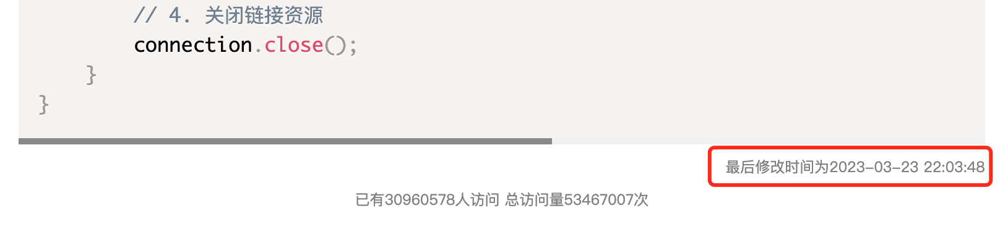

# mangodoc-update-time
mangodoc update-time plugin for show visit，集成[update-time](https://update-time.ibruce.info/)插件，显示文件修改时间！

[](https://www.npmjs.com/package/mangodoc-update-time)




## Usage
1. Configure mangodoc-update-time:(配置 ）

    ```html
    <script>
    window.$mangodoc = {
      // 开启update-time
      updateTime: {
        align: "right",// 默认
        prefix: "最后修改时间为",//默认
        format: "YYYY-MM-DD HH:mm:ss"// 默认
      }
    </script>
    ```

2. Insert script into mangodoc document:

    ```html
    <script src="https://unpkg.com/mangodoc-update-time@1.0.3/dist/mangodoc-update-time.min.js"></script>
    ```
